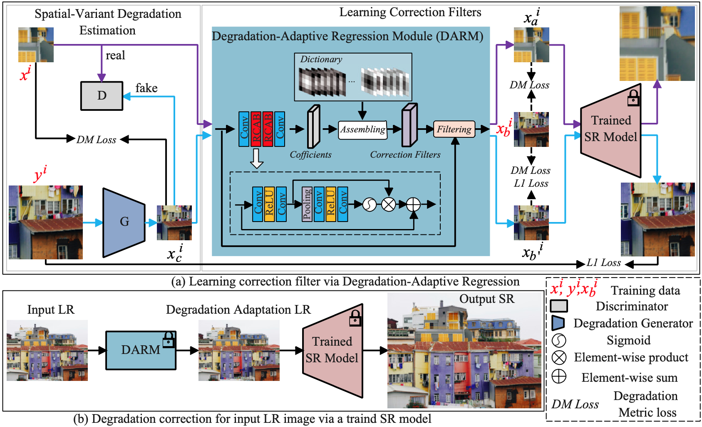

# DARSR

# Learning Correction Filter via Degradation-Adaptive Regression for Blind Single Image Super-Resolution

Pytorch implementation of our ICCV2023 paper "Learning Correction Filter via Degradation-Adaptive Regression for Blind Single Image Super-Resolution" 

[[ICCV]](https://openaccess.thecvf.com/content/ICCV2023/papers/Zhou_Learning_Correction_Filter_via_Degradation-Adaptive_Regression_for_Blind_Single_Image_ICCV_2023_paper.pdf)

Although existing image deep learning super-resolution (SR) methods achieve promising performance on benchmark datasets, they still suffer from severe performance drops when the degradation of the low-resolution (LR) input is not covered in training. To address the problem, we propose an innovative unsupervised method of Learning Correction Filter via Degradation-Adaptive Regression for Blind Single Image Super-resolution. Highly inspired by the generalized sampling theory, our method aims to enhance the strength of off-the-shelf SR methods trained on known degradations and adapt to unknown complex degradations to generate improved results. Specifically, we first conduct degradation estimation for each local image region by learning the internal distribution in an unsupervised manner via GAN. Instead of assuming degradation are spatially invariant across the whole image, we learn correction filters to adjust degradations to known degradations in a spatially variant way by a novel linearly-assembled pixel degradation-adaptive regression module (DARM). DARM is lightweight and easy to optimize on a dictionary of multiple pre-defined filter bases. Extensive experiments on synthetic and real-world datasets verify the effectiveness of our method both qualitatively and quantitatively.
<div align=center>

</div>

## Usage:

### Quick usage on testing dataset:  
To run on all images in <input_image_path>:

``` python main.py --input_dir <input_image_path> --gt_dir <gt_image_path> --scale_factor 2 --scale_factor_downsampler 0.5 --output_dir <output_image_path> ```


``` python main.py --input_dir <input_image_path> --gt_dir <gt_image_path> --scale_factor 4 --scale_factor_downsampler 0.25 --output_dir <output_image_path> ```

This will produce corrected LR images and SR results in the <output_image_path> folder. Note that GT images are only used to calculate PSNR, and does not participate in training.

example:

``` python main.py --input_dir LRx2 --gt_dir HR --scale_factor 2 --scale_factor_downsampler 0.5 ```

This will produce corrected LR images and SR images in the results folder


### Quick usage on your data:  
To run on all images in <input_image_path>:

``` python main.py --input_dir <input_image_path> --scalr_factor 2 --scale_factor_downsampler 0.5 --output_dir  <output_image_path> ```


``` python main.py --input_dir <input_image_path> --scalr_factor 4 --scale_factor_downsampler 0.25 --output_dir  <output_image_path> ```

This will produce corrected LR images and SR results in the <output_image_path>  folder

## Datasets
The datasets in NTIRE2017 and NTIRE2018 can be downloaded from [here](https://data.vision.ee.ethz.ch/cvl/DIV2K/).

The code is built on [KernelGAN](https://github.com/sefibk/KernelGAN) and [DualSR](https://github.com/memad73/DualSR). We thank the authors  for sharing the codes.

# Citation
```
@InProceedings{Zhou_2023_ICCV,
    author    = {Zhou, Hongyang and Zhu, Xiaobin and Zhu, Jianqing and Han, Zheng and Zhang, Shi-Xue and Qin, Jingyan and Yin, Xu-Cheng},
    title     = {Learning Correction Filter via Degradation-Adaptive Regression for Blind Single Image Super-Resolution},
    booktitle = {Proceedings of the IEEE/CVF International Conference on Computer Vision (ICCV)},
    month     = {October},
    year      = {2023},
    pages     = {12365-12375}
}
```

